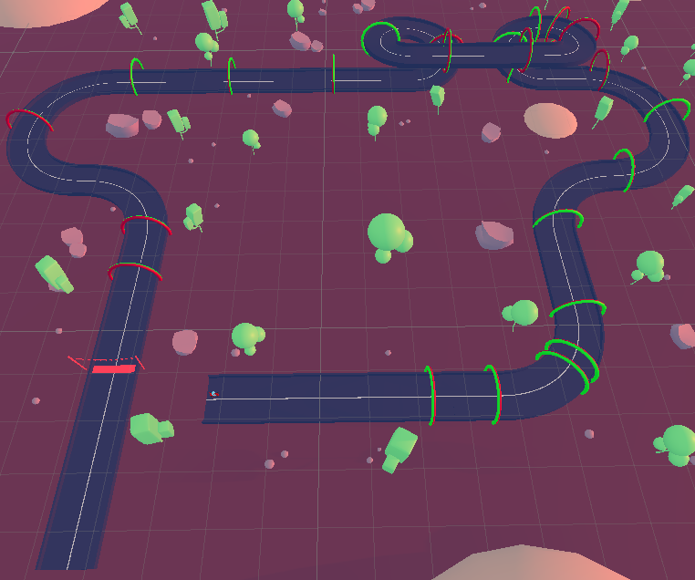

# AI Kart Racer (Unity ML-Agents Project)

## About This Project

This project is a Kart-Racing game where AI agents are trained to navigate a complex track using the Unity ML-Agents Toolkit. The goal was to implement a robust reinforcement learning environment where agents learn to drive efficiently, stay on the track, and complete laps.

[]

**Context:**  
Created in late 2022 as part of a vocational training project (Fachinformatiker für Anwendungsentwicklung).

> **Note:**  
> The original source code is no longer available. This repository serves as a portfolio piece, documenting the project's architecture, logic, and implementation through screenshots and a gameplay video.

---

## Core Concepts & Implementation

### 1. The Agent's Environment

- **Track:** A winding, low-poly course with turns, straights, and a figure-eight section.
- **Reward Gates:** Arch-like checkpoints guide the agent and are central to the reward system.
- **Boundaries:** Edges of the track act as negative reinforcement zones.

### 2. The AI Agent (The Kart)

#### Observations

- **Raycast Sensors:** Detect distances to walls and obstacles.
- **Directional Guidance ("Lakitu" System):**  
  Invisible trigger zones ("Lakitu") provide the agent with feedback on its alignment with the track, using a custom `LakituManager` script.

#### Actions

- **Movement:**  
  - 0: No input (coast)  
  - 1: Move Forward  
  - 2: Move Backward (small penalty)
- **Steering:**  
  - 0: No steering  
  - 1: Steer Left  
  - 2: Steer Right

#### Rewards

- **+1.0:** Passing a new checkpoint
- **-0.5:** Colliding with a wall or going off-track
- **-1.5:** Falling off the map (ends episode)
- **Small penalty:** Moving backward
- **Stuck penalty:** No progress for 6 seconds (ends episode)

### 3. Episode Management

- **Start:** Resets agent position, rotation, and checkpoints.
- **End:** Triggered by falling off or being stuck.
- **Lap Completion:** After all 19 checkpoints, the agent can start a new lap.

### 4. Scene Setup

- **AI Spawner:** Instantiates multiple agents at the starting line in a grid formation.

---

## Technology Stack

- **Game Engine:** Unity (2021.x)
- **Machine Learning:** Unity ML-Agents Toolkit v2.0.1
- **Programming Language:** C#

---

## Media & Documentation

- **Gameplay Video:**  
  See [`Gameplay.mp4`](./Gameplay.mp4) for a demonstration of the trained AI in action.
- **Images**  
  The `doku/` folder contains a lot of screenshots that document the core design and implementation choices of the project.

---

## License

This project is licensed under the MIT License. See [LICENSE](./LICENSE) for details.

---

# KI-Kart-Racer (Unity ML-Agents Projekt)

## Über das Projekt

Dieses Projekt ist ein Kart-Rennspiel, in dem KI-Agenten mithilfe des Unity ML-Agents Toolkits darauf trainiert werden, eine komplexe Strecke zu meistern. Ziel war es, eine robuste Reinforcement-Learning-Umgebung zu schaffen, in der Agenten effizientes Fahren, das Verbleiben auf der Strecke und das Absolvieren von Runden erlernen.

**Kontext:**  
Erstellt Ende 2022 als Teil eines Ausbildungsprojekts (Fachinformatiker für Anwendungsentwicklung).

> **Hinweis:**  
> Der ursprüngliche Quellcode ist nicht mehr verfügbar. Dieses Repository dient als Portfolio-Stück und dokumentiert Architektur, Logik und Implementierung anhand von Screenshots und einem Gameplay-Video.

---

## Kernkonzepte & Umsetzung

### 1. Die Umgebung des Agenten

- **Strecke:** Verwinkelte, low-poly Rennstrecke mit Kurven, Geraden und einer Acht.
- **Belohnungstore:** Bogenförmige Checkpoints leiten den Agenten und sind zentral für das Belohnungssystem.
- **Begrenzungen:** Streckenränder wirken als negative Verstärkungszonen.

### 2. Der KI-Agent (Das Kart)

#### Beobachtungen

- **Raycast-Sensoren:** Erfassen Abstände zu Wänden und Hindernissen.
- **Richtungsführung ("Lakitu"-System):**  
  Unsichtbare Triggerzonen ("Lakitu") geben Feedback zur Ausrichtung des Karts, gesteuert durch das Skript `LakituManager`.

#### Aktionen

- **Bewegung:**  
  - 0: Kein Input (rollen)  
  - 1: Vorwärts  
  - 2: Rückwärts (kleine Strafe)
- **Lenkung:**  
  - 0: Geradeaus  
  - 1: Links  
  - 2: Rechts

#### Belohnungen

- **+1,0:** Neues Checkpoint passiert
- **-0,5:** Kollision mit Wand oder Abkommen von der Strecke
- **-1,5:** Von der Karte gefallen (Episode endet)
- **Kleine Strafe:** Rückwärtsfahren
- **"Stuck"-Strafe:** 6 Sekunden ohne Fortschritt (Episode endet)

### 3. Episodenverwaltung

- **Start:** Setzt Position, Rotation und Checkpoints zurück.
- **Ende:** Bei Sturz oder Stillstand.
- **Rundenabschluss:** Nach 19 Checkpoints beginnt eine neue Runde.

### 4. Szenenaufbau

- **AI Spawner:** Platziert mehrere Agenten am Start in Gitterformation.

---

## Technologiestack

- **Game Engine:** Unity (2021.x)
- **Machine Learning:** Unity ML-Agents Toolkit v2.0.1
- **Programmiersprache:** C#

---

## Medien & Dokumentation

- **Gameplay-Video:**  
  Siehe [`Gameplay.mp4`](./Gameplay.mp4) für eine Demonstration der trainierten KI.
- **Screenshots & Diagramme:**  
  Im Ordner `doku/`:
  - KI-Design (`AI Design.PNG`)
  - Belohnungslogik (`arcadeKart_ai Belohnungs Logik.PNG`, `Belohnung Front .PNG`, `Belohnung Rückwärts.PNG`)
  - Steuerungslogik (`arcadeKart_ai Steuerungslogik.PNG`)
  - Variablenübersicht (`arcadeKart_ai variablen.PNG`)
  - Szenenaufbau (`Szene.PNG`)
  - Lakitu-System (`Lakitu Manager.PNG`)
  - AI Spawner (`aiSpawner.PNG`)
  - ML-Agents-Paketmanager (`PackageManager ML Agents.PNG`)
  - Episoden-Reset-Logik (`arcadeKart_ai resetScene zeitabzug.PNG`)
  - Weitere Notizen (`Unbenannt.PNG`)

---

## Lizenz

Dieses Projekt steht unter der MIT-Lizenz. Siehe [LICENSE](./LICENSE) für Details. 